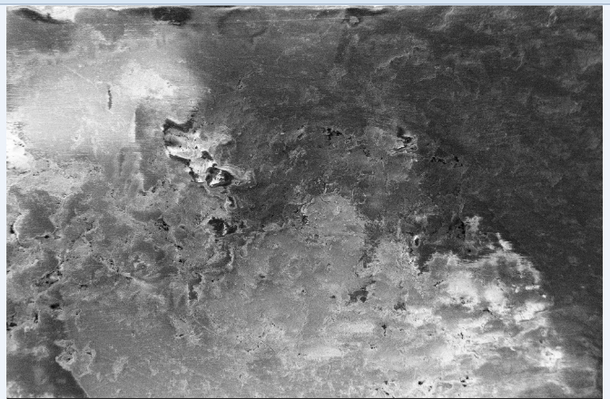
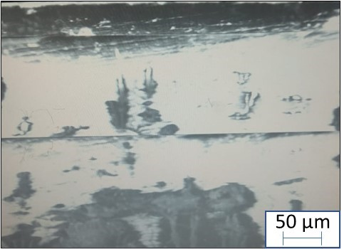

### Post Test

1. Quality of imaging on an insulating sample can be enhanced by: 
a)<b>Increasing the pressure of chamber (lower vacuum)</b>  
b)Decreasing the pressure of chamber (higher vacuum) 
2. Quality of imaging on an insulating sample will deteriorate when using: 
<b>a)Low accelerating voltage of electron beam </b> 
b)High accelerating voltage of electron beam 
3. The beam damage on a polymeric sample will be high at __________ accelerating voltage and _________ beam size. 
a.low accelerating voltage and smaller spot size 
b.low accelerating voltage and bigger spot size 
c.high accelerating voltage and smaller spot size 
<b>d.high accelerating voltage and bigger spot size</b> 
                        
4. Following image is taken at high kV (20 kV) or low kV (5 kV) for the insulating sample?  
 
<b>a.Low kV </b> 
b.High KV 

5.The following image is taken  _______________ conductive coating on the polymeric sample.
 
(i) with     <b>(ii) without</b> 

        
 