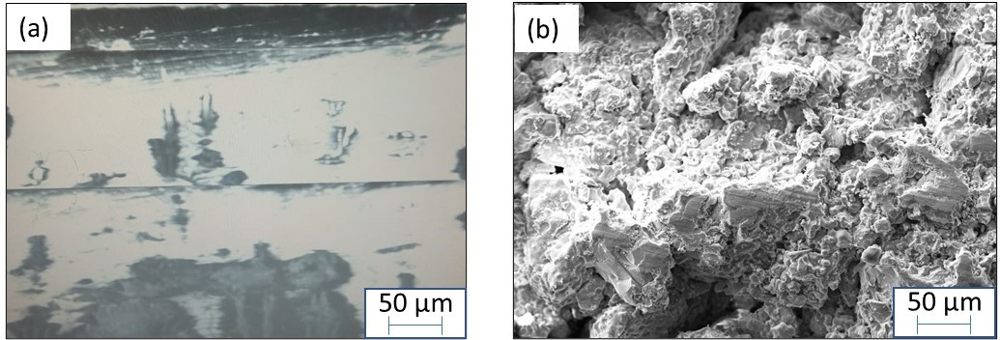

Going back to basics of electron microscopy, we can recollect that an electron beam is incident on the sample for imaging. As we know that electron beam comprises of electrons, which are negatively charged. This negative charge requires a conducting material for the its transport to the drain (for discharging), otherwise electrons will keep building up on the sample surface and will repel the incoming beam of electrons (Fig. 1a). Therefore, usually a conducting coating of gold or carbon is usually deposited on the insulating surfaces (typically for polymers and ceramics) to provide a conducting surface (Fig. ab). Carbon and gold, both satisfy the purpose of providing a thin layer of conducting film on the sample surface for an effective imaging. Carbon is much cheaper, but the carbon coating system is dirty (as it is black and produces char on the deposition jar that covers the system). Gold coating, on the other hand is costly. For biological samples, it is better to coat the samples with gold to avoid any interference from carbon from coating to the carbon from the biological material that may need to be analysed. For powder particles, usually a double-sided carbon tape is used.

<!-- 
<video width="320" height="240" controls>
  <source src="images/exp3-conducting_insulating.mp4" type="video/mp4">
  Your browser does not support the video tag.
</video> 
Video on Effect of Beam voltage on conducting and insulating samples 
 -->

<video width="320" height="240" controls>
  <source src="images/exp3-conducting_insulating.mp4" type="video/mp4">
  Your browser does not support the video tag.
</video> Video on Effect of Beam voltage on conducting and insulating samples

 We can appreciate that that particles (say spherical particles) will only have limited contact area with conducting carbon tape it is sitting on (say point contact), and even after gold coating, the shadow effect during sputtering may not cover the bottom region of the particle, and may not provide complete conductivity path. In that case, the particles may not be able to dissipate the charge and will show sample charging.
  

 
Fig. 1: Phenomenon showing a) repelling of incident electrons on an insulating surface, and  b) conduction of electron on conducting/coated surface.  

Even when the sample is conducting, the discharge from sample surface to the sample holder may occur through pinning screws, which may be an in-efficient carrier of charge. Thus, a copper-tape or a carbon-tape is routinely crossed over the sample (minimally affecting the region of interest) in order to avoid the problem of sample charging. The area of this conducting tape crossing over the sample becomes non-useful for imaging purpose.  
It may also be appreciated by the user that when the image is zoomed-up, a smaller area is being scanned. In other terms, the charge of incident beam should be carried out at a higher rate by the sample at higher magnification. So, if a sample is imaged at higher magnification first, and then we come down to a little lower magnification, a loss in contrast may appear eliciting beam-damage of that region (Fig. 2). Thus, selection of appropriate region for imaging, and utilising appropriate beam parameters are critical in procuring good images of the microstructural features.

  
 
  
 Fig. 2: The beam damage in the rectangular portion shows the area in which the beam scanning was performed (at higher magnification), and when zoomed down, the beam-damage area appears quite evident.
  
  

 When the sample is insulating, and when the charge starts to build up (i.e. when the sample is not coated, or the sample to sample-holder connection is weak, or even when the individual particles sitting on carbon tape are not able to conduct). In that case, the charge (or collection of electrons) start to repel the on-coming electrons. As the incident electrons get repelled, they very easily reach the detector, and saturate the detector. In other word, the entire screen appears very bright, and the actual features are not captured (Fig. 3a). Thus, it becomes important to play with the available parameters to dissipate the developed charge. There are few ways in which this can be done: 
  
    (i)	 Lower the accelerating voltage. The usual imaging voltage is 20kV, which can be lowered down (say to 5 &nbsp;kV)  for  imaging insulating samples. That way lower energy of electrons does not let them stick to the sample surface and the charge build-up on sample surface is reduced.   
    (ii)  Lowering the vacuum (or operating at higher pressure). The typical vacuum level of 10-5 torr, can be brought down (or pressure can be increased to say 10-3 torr). This pressure will scatter electrons and reduce the charge build-up on insulating surfaces. This lowering of vacuum, though, damages the beam column and filament life. This may also lead to contamination of the chamber as the instrument is operating at lower vacuum levels.   
    (iii)	 Another aspect of reducing charge build-up is be restricting the time-duration in which the sample is exposed to incident beam. It is advised that the images can be captured spending least time so the net beam-time is minimised and, accordingly, the charge build-up will be minimised.  
    (iv)	 Best way to dissipate the charge is by depositing a conducting coating of gold (Au) or carbon as discussed during the start of the theory section. Now, you will appreciate the clarity of image that can be visualised under scanning electron microscopy after the gold-coating of the same sample (Fig. 3b). Appreciate the sharpness of feature and that saturation of surface no more hinders the observation of features on the sample.  

  
Figure 3: a) Image of uncoated insulating samples showing charging on the surface, and b) image of the ceramic sample after gold coating. Note that the features are now visible and appear sharp. 
 
 

Note:
Biological samples and polymeric samples may undergo beam damage during imaging. Sample burning or evaporation may also occur upon exposure to electron beam. The build-up of volatile gases may also be very deleterious to the instrument itself. Thus, it is advisable to know the nature of the samples being imaged beforehand. There is a new class of SEM instrument called ‘environmental SEM’ which has the sample chamber separated by a differential pumping across the different SEM sections. Here, biological samples or wet-samples may also be imaged (which may otherwise lose the water vapor and deform). 

 
 
 
 
 
 
 